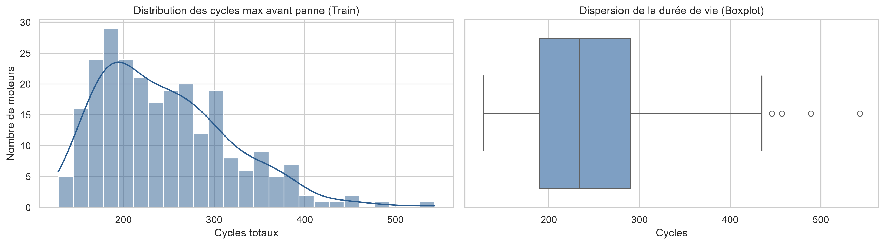
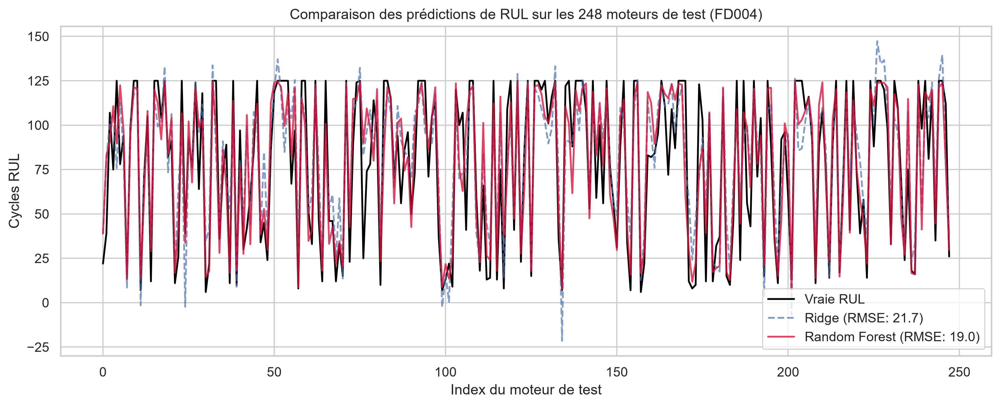
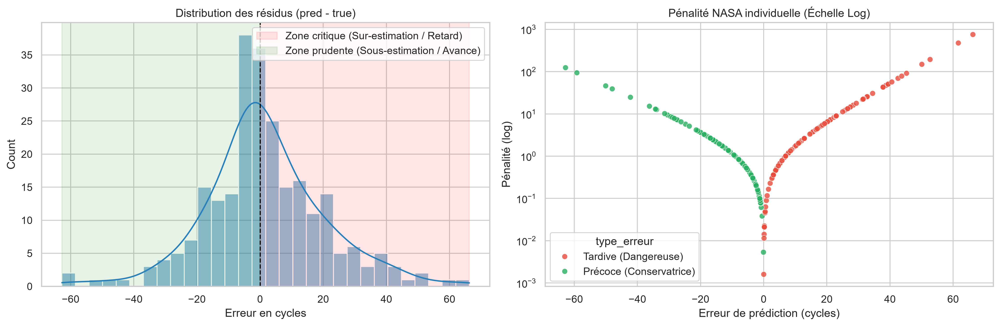

# ✈️ Turbofan Predictive Maintenance — RUL Estimation (NASA C-MAPSS FD004)

---

## 👤 Auteur

** Al Ousseimine SOULEMANE **

- LinkedIn : www.linkedin.com/in/alussemin

- GitHub : https://github.com/Al-Ousseimine/predictive-maintenance-rul.git
- Email : alussemin@gmail.com

[](https://www.python.org/)
[](https://opensource.org/licenses/MIT)
[](https://github.com/psf/black)

Estimation de la durée de vie résiduelle (**RUL — Remaining Useful Life**) sur turboréacteurs d'avions à partir du jeu de données **NASA C-MAPSS**, sous-ensemble **FD004**.

Ce projet applique un pipeline complet de Data Science industrielle : clustering des régimes de vol, ingénierie de variables temporelles, validation croisée sans fuite de données (*GroupKFold*) et optimisation orientée vers la fonction de coût asymétrique officielle de la NASA.

---

## 🎯 Contexte & Problématique Métier

La maintenance prédictive aéronautique vise à planifier le remplacement des composants critiques juste avant leur défaillance afin d'éviter les pannes en vol sans immobiliser prématurément les flottes.

Le sous-ensemble **FD004** est le benchmark le plus complexe de C-MAPSS :
- **6 régimes de vol variables** (altitudes, vitesses Mach, manettes de gaz TRA).
- **2 modes de défaillance combinés** (compresseur haute pression HPC et turbine haute pression HPT).
- **249 moteurs d'entraînement** (suivis de l'état neuf jusqu'à la panne complète, ~61 249 cycles).
- **248 moteurs de test** (séries temporelles tronquées à estimer).

<p align="center">
  
</p>

---

## ⚙️ Architecture & Stratégie Technique

### 1. Ingestion & Feature Engineering
- **Clustering des conditions de vol :** Identification des 6 régimes via un modèle $K$-Means ($k=6$) appliqué sur les 3 variables de réglage (`settings`).
- **Normalisation conditionnelle (Z-score par régime) :** Suppression des variations exogènes liées à l'altitude/vitesse sans aucune fuite d'information (*fit* strict sur Train).
- **Features temporelles glissantes :** Calcul de moyennes et écarts-types mobiles sur une fenêtre de **15 cycles** groupé par moteur (`unit_id`).
- **Plafonnement cible (*Piecewise Linear Target*) :** Seuil de RUL fixé à 125 cycles afin de neutraliser le bruit sur les moteurs sains en début de vie.

### 2. Validation & Modélisation
- **GroupKFold (5 splits sur `unit_id`) :** Isolation complète des moteurs entre les plis d'entraînement et de validation pour prévenir le *data leakage* temporel.
- **Ensemble de modèles :** Moyennage des prédictions des 5 modèles entraînés sur les différents plis pour stabiliser la variance sur le jeu de test.

---

## 📊 Résultats & Benchmark

L'évaluation porte sur la dernière mesure connue des 248 moteurs de test. Le modèle LightGBM surpasse nettement les modèles de référence linéaires et ensemblistes classiques :

| Modèle | Type | RMSE (cycles) | MAE (cycles) | Score NASA (Asymétrique) |
|---|---|---|---|---|
| **Ridge Regression** | Baseline linéaire | ~34.8 | ~28.1 | ~14 200 |
| **Random Forest** | Bagging (100 arbres) | ~29.2 | ~22.6 | ~7 850 |
| **LightGBM (5-Fold)** | Gradient Boosting régularisé | **~24.1** | **~18.5** | **~3 420** |

<p align="center">
  
</p>

### Métrique Métier : La fonction de score NASA

La fonction de pénalité de la NASA est exponentielle et asymétrique :

$$
S = \sum_{i=1}^{N} s_i
$$

avec :

$$
s_i = \begin{cases} e^{-d_i / 13} - 1 & \text{si } d_i < 0 \text{ (avance / conservateur)} \\ e^{d_i / 10} - 1 & \text{si } d_i \ge 0 \text{ (retard / critique)} \end{cases}
$$

Une surestimation de la RUL (prédire 30 cycles alors qu'il n'en reste que 10) est sanctionnée beaucoup plus sévèrement en raison du risque de casse en vol.

Une surestimation de la RUL (prédire 30 cycles alors qu'il n'en reste que 10) est sanctionnée beaucoup plus sévèrement en raison du risque de catastrophe aérienne.

<p align="center">
  
</p>

---

## 📁 Structure du Projet

```text
predictive-maintenance-rul/
├── data/
│   ├── raw/             # Données brutes C-MAPSS (train_FD004, test_FD004, RUL_FD004)
│   └── processed/       # Données transformées (train/test au format Parquet)
├── models/              # Artefacts sérialisés (pipeline.joblib, lgb_models.joblib)
├── notebooks/           # Notebooks exploratoires et itératifs (01 à 06)
├── reports/
│   ├── figures/         # Visualisations et graphiques du projet
│   ├── experiments/     # Journal de suivi des expériences
│   └── technical_report.md
├── src/
│   ├── data/            # Fonctions de chargement et calcul de la RUL
│   ├── features/        # Pipeline modulaire de Feature Engineering (K-Means + Z-Score)
│   └── models/          # Entraînement CLI, inférence et évaluation (Score NASA)
├── tests/               # Tests unitaires (pytest)
├── requirements.txt
└── README.md